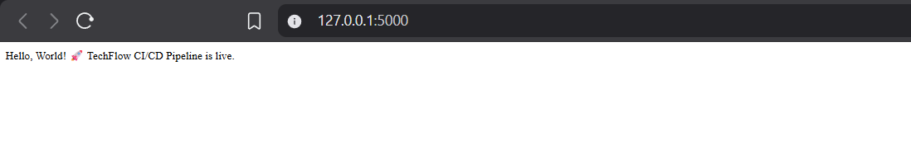
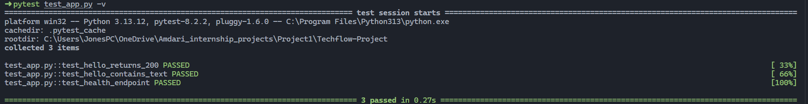
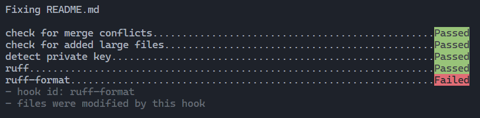
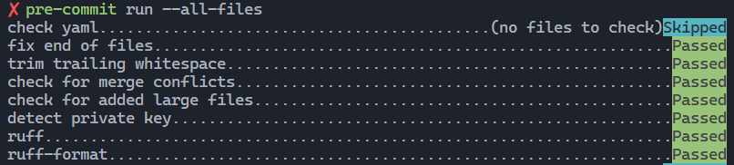
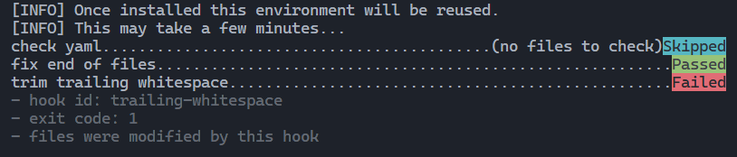
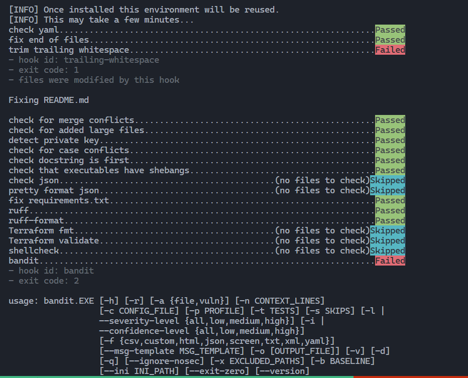
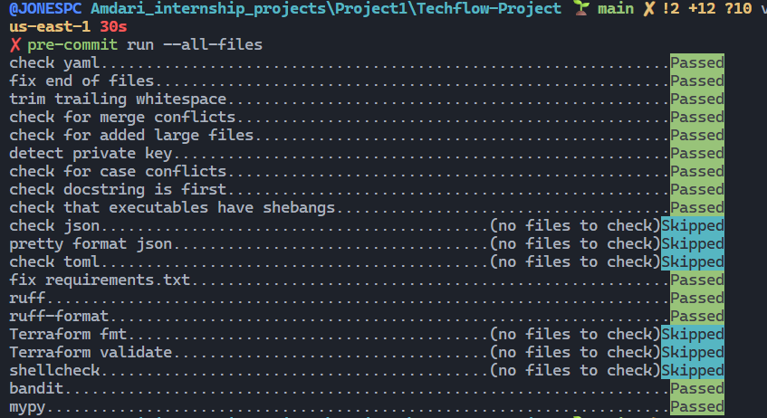
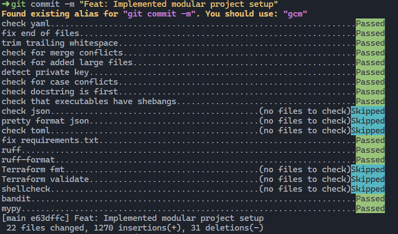
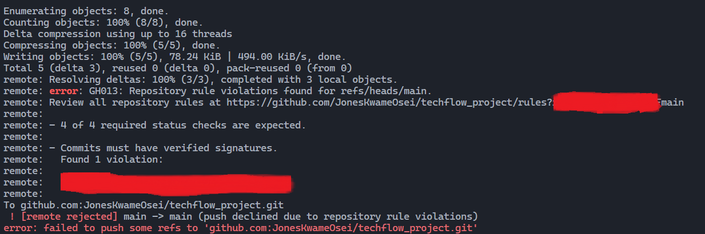
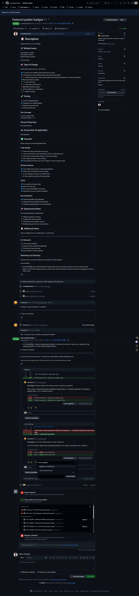

# TechFlow CI/CD Project 🚀

[](https://github.com/Dcoder21/Techflow-Project/actions/workflows/pipeline.yml)
[](https://github.com/pre-commit/pre-commit)
[](https://github.com/astral-sh/ruff)
[](https://python.org)
[](https://flask.palletsprojects.com/)
[](LICENSE)
[](https://github.com/PyCQA/bandit)

---

## Overview

This project demonstrates a robust fully automated CI/CD pipeline that takes code from development all the way to a live server with zero manual intervention. It showcases modern DevOps practices with comprehensive testing, security scanning, and automated deployments.

### 🎯 Current Implementation

- **Flask Web Application** with health endpoints
- **Comprehensive CI/CD Pipeline** with GitHub Actions
- **Pre-commit Hooks** for code quality enforcement
- **Multi-Python Testing** across Python 3.9-3.12
- **Security Scanning** with Safety and Bandit
- **Branch Protection Rules** and automated PR checks
- **Code Coverage** reporting and analysis

---

## 🚨 The Problem This Solves

### The Problem Statement

In a traditional software development process, developers write code and then manually deploy it to servers. This can lead to several issues:

- **Human Error**: Manual steps can be forgotten or done incorrectly, leading to failed deployments.
- **Slow Feedback Loop**: Developers may not find out about bugs or issues until after deployment, which can be hours or days later.
- **Deployment Anxiety**: Running tests locally is not the same as running them in a production-like environment. This can lead to "it works on my machine" scenarios where code breaks after deployment. Also, tests become inconsistent across development teams and environments, leading to confusion and mistrust in the testing process, which can result in developers skipping tests altogether. This makes testing less effective and increases the likelihood of bugs reaching production.
- **Operational Friction**: Manual deployment leaves room for developers to manually `SSH` into production servers to pull the latest code and restart servers, which can lead to security risks and inconsistent environments.
- **Lack of Rollback**: If something goes wrong during deployment, there may be no easy way to revert to the last known good state, leading to prolonged downtime.
- **Customer Impact**: Failed deployments mostly lead to downtime, which negatively impacts user experience and can damage the company's reputation.

---

### The Solution: A fully automated CI/CD pipeline that runs tests, builds Docker images, deploys to a live server, and recovers from failures automatically

The primary obstacle to manual deployment is that it relies manly on lack of environment parity due to human error. By automating the entire process, we can ensure that every step is executed consistently and correctly, reducing the chances of failure and improving the overall reliability of the deployment process.

This project builds an infrastructure so that every time a developer pushes code to `main`, the following happens automatically:

```sh
Developer pushes code
        ↓
 Tests run automatically
        ↓
 Docker image is built & stored
        ↓
 App is deployed to a live server
        ↓
 Team receives an email: Success or Failure
        ↓
 Iterative feedback loop
```

> If anything goes wrong during deployment, the system should **automatically recover** without human intervention.

---

## Project Setup

### Run the app and tests locally

Every automation begins with understanding the manual process. After cloning the repo, it is ideal to run it locally to understand what it does and how it works before you start building the pipeline. The project structure is as follows:

```plaintext
Techflow-Project
|-- Project-README.md
|-- README.md
|-- app.py                 # A Flask web app
|-- gitignore.txt
|-- requirements.txt       # Python dependencies
`-- test_app.py            # Tests for the app
```

- Step 1: cd into repo and Install dependencies and run the app:

```python
cd Techflow-Project
pip install -r requirements.txt
python app.py
# Visit http://localhost:5000
```



---

- Step 2: Run the tests to see what "passing" looks like:

```bash
pytest test_app.py -v
```

**Tests passed**:



> All 3 tests should pass. The pipeline must make these same tests pass in an automated environment.
---

## Implementation of CI/CD Automation

Having understood how the app works and what the tests do, we can start building the automation. The tools to be use are:

- **GitHub Actions** for CI/CD orchestration
- **Docker** for containerization
- **DockerHub** for image registry
- **Bash** for scripting health checks and rollbacks
- **Terraform** for infrastructure as code
- **Gmail SMTP** for email notifications
- **AWS EC2** for hosting the live server

### Security Implementation

- **Precommit Hooks**: Implement precommit hooks to run tests locally before allowing a commit. This ensures that broken code never even reaches the pipeline.
- **Secrets Management**: All sensitive information (e.g., DockerHub credentials, EC2 SSH keys, email credentials) will be stored securely using GitHub Secrets. No secrets should be hardcoded in any files.
- **Disable root login**: Ensure that root login is disabled on the EC2 instance to prevent unauthorized access.
- **No Root access for user in Docker Container**: The Dockerfile will be configured to run the application as a non-root user to minimize security risks.
- **Configure SSH Access**: Ensure that SSH access is properly configured with key-based authentication and that only authorized users can access the EC2 instance and there are no manual user access to the server.
- **Use of App Passwords**: For email notifications, Gmail App Passwords will be used instead of regular passwords to enhance security.

---

### One Important Setup Step: Pre-commit Hooks

It it relevant  `pre-commit` installed and run it either locally and/or set up pre-commit hooks to automatically run tests before every commit. This ensures that broken codes or issues are caught before they land in `Git history`.

#### Local setup (recommended path: pre-commit framework)

- Install `pre-commit`:

   ```python
   pip install pre-commit
   ```

- Create a `.pre-commit-config.yaml` file in the root of repo.

- Install the pre-commit hooks:

   ```bash
   pre-commit install
   ```

- Run the hooks on all files to ensure everything is working:

   ```bash
   pre-commit run --all-files
   ```





The pre-commit hooks were successfully installed and run on all files.But some of the files were not formatted correctly and the tests failed. This is the need for pre-commit hooks - to catch these issues before they even get committed.

These files that failed were well formatted after and subsequently passed.



- Add a pre-push hook to run tests before every push. Then enforce that all developers must have this hook installed before they can push to `main`.

```sh
pre-commit install --hook-type pre-push
```

---

## ✅ Current CI/CD Implementation

The project now includes a comprehensive CI/CD pipeline with the following features:

### 🔧 GitHub Actions Workflows

**Main Pipeline ([pipeline.yml](.github/workflows/pipeline.yml))**

- ✅ **Pre-commit Enforcement**: Runs all configured hooks to ensure code quality
- ✅ **Multi-Python Testing**: Tests on Python 3.9, 3.10, 3.11, 3.12
- ✅ **Security Scanning**: Safety (for vulnerabilities) and Bandit (for security)
- ✅ **Build Validation**: Application startup and health check tests
- ✅ **Code Coverage**: Pytest-cov with coverage reporting

**PR Checks ([pr-checks.yml](.github/workflows/pr-checks.yml))**

- ✅ **PR Title Validation**: Enforces conventional commit format
- ✅ **PR Size Limits**: Prevents overly large pull requests
- ✅ **Merge Conflict Detection**: Automatic conflict checking
- ✅ **Label Requirements**: Ensures proper PR categorization
- ✅ **Branch Freshness**: Warns when PRs are behind main

### 📋 Repository Standards

- ✅ **CODEOWNERS**: Automatic reviewer assignment
- ✅ **Issue Templates**: Standardized bug reports and feature requests
- ✅ **PR Templates**: Comprehensive pull request checklist
- ✅ **GitHub Labels**: Complete labeling system for issues and PRs

### 🛠️ Developer Tools

```bash
# Install development dependencies
pip install -r requirements-dev.txt

# Set up pre-commit hooks
pre-commit install
pre-commit install --hook-type commit-msg

# Run all checks locally
pre-commit run --all-files

# Set up GitHub labels (optional)
python setup_labels.py --token YOUR_GITHUB_TOKEN --repo owner/repo
```

### 🔒 Branch Protection Setup

See [CI-CD-SETUP.md](CI-CD-SETUP.md) for detailed instructions on:

- Configuring GitHub branch protection rules
- Setting up required status checks
- Enabling required reviews and signed commits
- Configuring automatic security scanning

---

### Validate Setup before push to remote

Finally, the project is now set up with a robust CI/CD pipeline that ensures code quality, security, and reliability at every step of the development process. The next phase will be to implement the Dockerisation and deployment automation to complete the end-to-end CI/CD workflow.

However, there is a need to validate the files to be pushed since there has been a lot of updates:

```shell
pre-commit run --all-files
```




All checks have passed successfully. The code is now ready to be pushed to the remote repository, where the GitHub Actions workflows will take over and run all the automated checks and processes as configured.



`Git commit` is subsequently successful. All **security** checks passed. Now code can be pushed to the repo.



**Branch protection** is working as expected. Now:




- Changes must be made through a `pull request` - Direct pushes to `main` are blocked.
- `4 of 4 checks` must pass before merging - All GitHub Actions checks must succeed.
- `1 approving review` is required - At least one code owner must approve the PR.
- `Commits must have verified signatures` - Needs signed commits to ensure authenticity.

### Pull Request Code QualityChecks

- All pre-commit hooks run automatically on the PR branch.
- For any hook that failed, the PR showed the failed checks and cannot be merged until all issues



---
